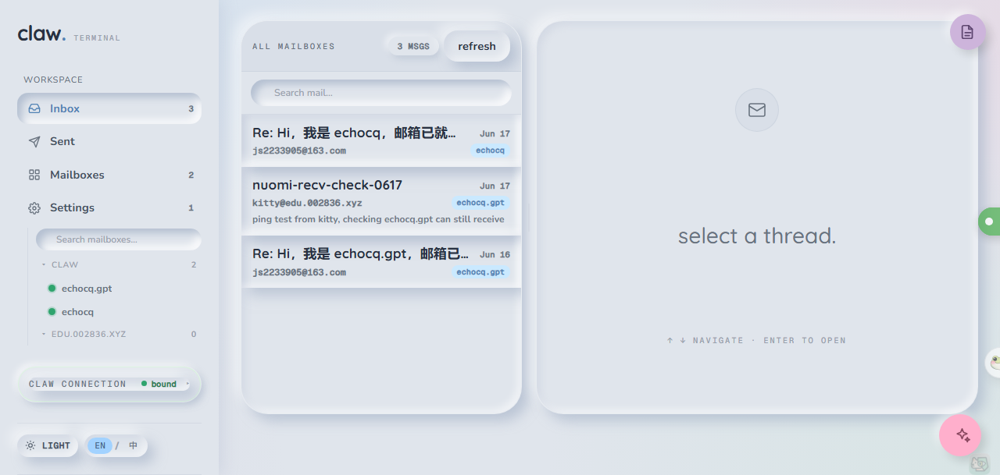
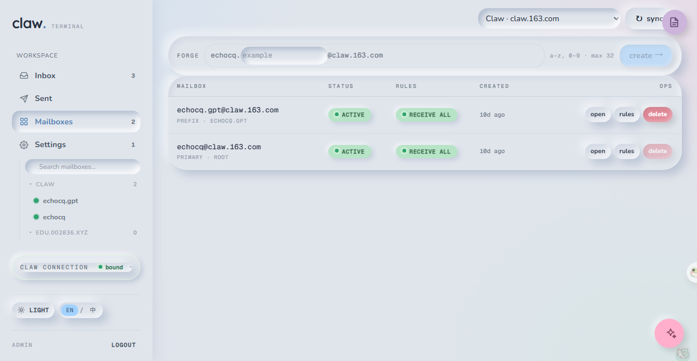
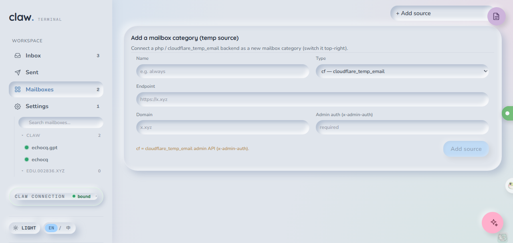
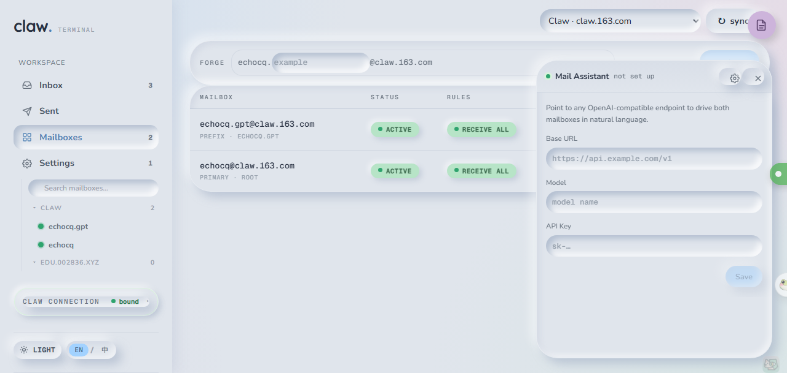

# ClawEmail

> **One console for `claw.163.com` sub-mailboxes and `cloudflare_temp_email`-compatible temp inboxes — with a native AI assistant.**
>
> 一个面板，统一管 `claw.163.com` 真实子邮箱 + 兼容 `cloudflare_temp_email` 的临时邮箱，内置可操作邮箱的 AI 助手。

基于 `claw.163.com` 的**子邮箱批量管理 / 实时收发**一体化前后端，并向外扩展为一座 **canonical cloudflare_temp_email 桥**：对内统一聚合 claw 子邮箱与多个临时邮箱 provider，对外用标准 cf 格式吐出一套 `/ext/*` API 供任意 cf_temp_email 客户端消费。通过 Web UI 验证码登录 Claw，自动派生 Dashboard Cookie 与 API Key，为每个子邮箱维持长连接监听，新邮件实时入库并经 SSE 推送给前端，可在线发件、回复、删除（远端 + 本地双删）、下载附件。

---

## ✨ 亮点 / 为什么用它

| 优势 | 说明 |
|---|---|
| 🗂️ **一个面板，两类邮箱** | 同时统一管 `claw.163.com` 真实子邮箱 + 兼容 `cloudflare_temp_email` 的临时邮箱；**右上角按「大类目」切换**（Claw / 各临时源），临时源支持多 provider、可热增删改。 |
| 🌉 **标准对齐 · canonical-cf 桥** | 既作为 canonical cloudflare_temp_email 的**客户端**接入上游临时源，又通过 `/ext/*` 出口把自己变成一个 canonical cf **服务端**，供其它项目按标准格式消费。 |
| 🤖 **AI 原生** | 内置 Notion 式 AI 助手气泡，OpenAI 兼容端点，工具调用循环可直接操作邮箱（列表 / 读信 / 搜索 / 发信 / 回复 / 建址）。危险动作走两段式确认卡 + 撤销栈，不怕误操作。 |
| 📥 **统一收件箱 + 统一发件箱** | claw 与各临时源的收发聚合到一处，收件箱一键拉全部邮箱，发件箱实时读 Claw「已发送」folder。 |
| 💾 **易失主机也不丢数据** | Supabase 持久化，HF Space 重启后自动 hydrate 灌回本地 SQLite，绑定与邮件不丢。 |
| 🛡️ **安全加固** | 邮件正文 `iframe sandbox`（防恶意邮件偷管理员口令）、`trustProxy` 防 XFF 伪造绕封禁、出口 admin 越权防护、出口发信日限额、到信 webhook（免轮询）。 |
| 🔐 **访问铁门** | 所有 `/api/*` 必须带 admin 密码（`X-Admin-Password` 或 `?token=`），public 部署务必用强 Secret 覆盖默认值。 |
| 🚀 **多形态部署** | Docker / docker compose / Hugging Face Docker Space / Cloudflare Workers，按需挑一种。 |

---

## 📸 界面预览


*统一收件箱：claw 子邮箱与各临时源邮件聚合一处，行带来源标签，新信经 SSE 实时入列。*


*邮箱管理：右上角「大类目」下拉在 Claw 与各临时源之间切换，下方只显示该类目的邮箱/地址与管理；左栏每个大类目一组折叠绿点。*


*接入新大类目：选「＋ 添加源」即可挂上一个 php 自建 / cloudflare_temp_email 临时邮箱后端，作为一个新的邮箱大类目。*


*右下角 AI 助手气泡：OpenAI 兼容端点驱动，工具调用循环直接操作邮箱；危险动作出确认卡，可一键撤销。*

---

## 🧩 功能矩阵

| 模块 | 能力 | 实现位置 |
|---|---|---|
| Claw 绑定 | 邮箱 + 验证码两步登录；自动取 `auth/me` / `workspaces` / `mailboxes` / `api-keys`；写入 SQLite | `routes/claw-auth.ts`、`runtime-config.ts` |
| 邮箱管理 | 创建（前缀 `^[a-z0-9]{1,32}$`）、列表、`?sync=true` 与远端做差量同步、删除（拒绝删主邮箱） | `routes/mailboxes.ts`、`claw-dashboard.ts` |
| 通讯规则 | 同步并保存 `commLevel` / `extReceiveType` / `extSendType`；邮箱页可配置个人 / 内部 / 外部通信范围 | `routes/mailboxes.ts`、`CommunicationRulesDrawer.tsx` |
| 实时收件 | 每个 `active` 邮箱一条 WS 监听；落库为 `mails` + `attachments`；SSE `event: mail` 推送 | `listener-manager.ts`、`sse.ts` |
| 邮件详情 | 返回行 + 解析后的原始 JSON + 附件元数据 | `routes/mails.ts` |
| 删信 | SDK `moveMessages([id], "Trash")` 远端删除 + 本地行删除 | `claw-mail.ts`、`routes/mails.ts` |
| 发件 / 回信 | 仅允许 `from` 是本地已管理邮箱；回信基于本地 `mailId` 反查 `provider_mail_id` | `routes/send.ts` |
| 附件下载 | 不缓存原始字节，按需经 SDK 流式拉取 | `routes/mails.ts` |
| 临时邮箱多源 | provider 注册表，两类型：`php`（自建全功能）与 `cf`（cloudflare_temp_email 兼容），可热增删改 | `temp-providers.ts`、`cf-mail.ts`、`routes/cf-mail.ts` |
| 对外出口 | `/ext/*` 用 canonical cf 格式统一吐所有邮箱，供任意 cf_temp_email 客户端建址 / 收信 / 发信 | `ext-egress.ts`、`routes/ext-cf.ts` |
| AI 助手 | OpenAI 兼容端点 + 工具调用循环操作邮箱；危险动作两段式确认卡 + 撤销栈 | `AiBubble.tsx`、`ai-agent.ts`、`routes/ai.ts` |
| 持久化 | Supabase REST 同步 + 启动 hydrate，HF 重启不丢数据 | `supabase-sync.ts`、`hydrate.ts` |
| 监听器诊断 | `/api/listeners` 输出 `email/connected/retry`；前端有侧栏摘要 + 抽屉详情 | `routes/events.ts`、`ListenersDrawer.tsx` |
| 前端体验 | 中英双语、暗亮主题、拖拽栏宽（侧边栏 / 邮件列表）、登录态 localStorage 记忆 | `i18n.tsx`、`hooks.ts` |

---

## 1. Claw 验证码登录链

不收集任何 Claw 密码。`POST /api/auth/claw/verify-code` 内部串联以下接口：

```http
POST https://claw.163.com/mailserv-claw-dashboard/p/v1/auth/email/send-code
POST https://claw.163.com/mailserv-claw-dashboard/p/v1/auth/email/verify-code   → Set-Cookie: CLAW_SESS
GET  https://claw.163.com/mailserv-claw-dashboard/api/v1/auth/me
GET  https://claw.163.com/mailserv-claw-dashboard/api/v1/workspaces
GET  https://claw.163.com/mailserv-claw-dashboard/api/v1/mailboxes?workspaceId=<id>
GET  https://claw.163.com/mailserv-claw-dashboard/api/v1/api-keys
```

落库（SQLite `app_settings` 表）：`claw.apiKey` / `claw.dashboardCookie` / `claw.userEmail` / `claw.workspaceId` / `claw.parentMailboxId` / `claw.rootPrefix` / `claw.domain`。`workspace` 取 `status=active`，`apiKey` 取 `defaultFlag=1` 优先。绑定成功后会先 `stopAllMailboxListeners()` + `resetMailClients()` 再用新凭据 `startAllMailboxListeners()`，避免旧连接残留。

---

## 2. 本项目 HTTP API

### 2.1 鉴权

所有 `/api/*` 必须带 `X-Admin-Password: <ADMIN_PASSWORD>`。浏览器无法自定义头的场景（SSE、附件 `<a href>`）改用 `?token=<ADMIN_PASSWORD>`。两者命中其一即放行（见 `src/server/index.ts: extractAdminPassword`）。

### 2.2 端点清单

```http
GET    /health
GET    /api/auth/claw/status
POST   /api/auth/claw/send-code
POST   /api/auth/claw/verify-code
POST   /api/auth/claw/refresh
POST   /api/auth/claw/logout

GET    /api/mailboxes                # 仅本地
GET    /api/mailboxes?sync=true      # 与 Claw 做差量同步后再返回
POST   /api/mailboxes                # { suffix }
POST   /api/mailboxes/:id/comm-settings      # { commLevel, extReceiveType?, extSendType? }
DELETE /api/mailboxes/:id

GET    /api/mails?mailbox=&limit=50&offset=0
GET    /api/mails?sync=true&mailbox=...      # 远端 INBOX 全量比对
GET    /api/mails/:id                        # 详情 + 解析后 JSON + 附件元数据
DELETE /api/mails/:id                        # 远端移到 Trash + 本地删除
GET    /api/mails/:id/attachments/:partId    # 流式下载附件

POST   /api/send                              # { from, to[], cc?, bcc?, subject?, body?, html? }
POST   /api/reply                             # { mailId, body?, html?, toAll? }

GET    /api/events                            # SSE: event: mail
GET    /api/listeners
```

入参经 zod 校验；失败返回 `400 {error:"invalid input", details:[...]}`。SSE 事件形如 `event: mail` + `data: {"mailboxEmail":"...","id":42,"providerMailId":"..."}`。

> 临时邮箱（cf / php provider）相关端点在 `/api/cf/*`（带 `?provider=<id>`）；对外 canonical 出口在 `/ext/*`。

---

## 3. 数据持久化

SQLite 文件由 `DATABASE_PATH` 指定（默认 `./data/app.db`），开启 `journal_mode=WAL` + `foreign_keys=ON`。

```text
mailboxes      子邮箱：id / email(unique) / prefix / status / comm_level ...
mails          邮件：mailbox_email + provider_mail_id 联合唯一，含 raw_json 全文
attachments    附件元数据：mail_id 外键 → mails.id（ON DELETE CASCADE）
app_settings   key/value，存 Claw 凭据与运行时配置
```

附件二进制**不入库**，下载时调 `client.mail.getAttachment` 流式回传给浏览器。

> 部署在 HF Space 等易失存储上时，接入 Supabase 做云端持久化：写函数 fire-and-forget push 到云端，启动时先 `hydrate` 灌回本地 SQLite，重启不丢数据（见环境变量 `SUPABASE_URL` / `SUPABASE_SERVICE_KEY`）。

---

## 4. 监听器与重连

`src/server/listener-manager.ts`：

- 启动条件：邮箱 `status === "active"` 且 `hasClawMailConfig()` 为真
- 退避序列：`[1, 2, 4, 8, 16, 30]` 秒
- `client.ws.onMessage` 收到 mailId → `client.mail.read({markRead:true})` → `saveMail` → SSE `mail` 广播
- `client.ws.onDisconnect` 触发 `scheduleReconnect`；删邮箱 / 断开 Claw 时显式 `stopMailboxListener` 关闭 WS

`/api/listeners` 返回 `{ email, connected, retry }`，前端 `ListenersDrawer` 兼容未来扩展字段。

---

## 5. 环境变量

```env
NODE_ENV=production
PORT=3000
ADMIN_PASSWORD=change-me

# 以下变量是"兜底值"，验证码登录成功后会被 SQLite 中的值覆盖
CLAW_API_KEY=
CLAW_DASHBOARD_COOKIE=
CLAW_WORKSPACE_ID=
CLAW_PARENT_MAILBOX_ID=
CLAW_ROOT_PREFIX=
CLAW_DOMAIN=claw.163.com

DATABASE_PATH=./data/app.db
```

读取顺序（`runtime-config.ts`）：`SQLite app_settings` → `process.env`，缺一则 API 报 `... is required; connect Claw first`。

> ⚠️ **安全提醒**：`ADMIN_PASSWORD` 缺省为 `change-me`，这是公开部署的后门。public 部署务必用强 Secret 覆盖，否则面板裸奔。

---

## 6. 本地运行

应用监听端口由 `PORT` 环境变量控制，默认 **3000**（host `0.0.0.0`）。

```powershell
npm install
npm run build
npm start
# 默认 http://localhost:3000；改端口： $env:PORT=8080; npm start
```

开发：

```powershell
npm run dev          # tsx 跑后端，监听 :3000（受 PORT 控制）
npm run dev:web      # Vite 跑前端，监听 :5173
npm run typecheck    # tsc --noEmit
```

`npm run build` = `vite build` 产出静态资源到 `dist/web` + `esbuild` 打包后端到 `dist/server/index.js`，`@clawemail/node-sdk`、`fastify`、`better-sqlite3` 等保持 external。

---

## 7. Docker 部署

容器内进程恒定监听 `3000`，宿主端口由 `ports` 左侧决定（默认 `3000:3000`）。

### docker compose

```powershell
git clone https://github.com/zhizhishu/ClawEmail.git
cd ClawEmail
cp .env.example .env
docker compose up -d
curl http://localhost:3000/health
```

### docker run（本地构建镜像）

```bash
docker build -t clawemail .
docker run -d --name clawemail \
  -p 3000:3000 \
  -e ADMIN_PASSWORD=change-me \
  -v "$PWD/data:/app/data" \
  clawemail
```

`./data` 挂到 `/app/data` 持久化 SQLite。

---

## 8. Cloudflare 无服务器部署

本仓库同时提供 Cloudflare Workers + Static Assets + D1 的部署入口：

```text
src/cloudflare/          Cloudflare Worker API（无 Fastify / better-sqlite3 / Node SDK）
migrations/0001_initial.sql
wrangler.toml
```

限制边界：

- Cloudflare 版不运行常驻邮箱 WebSocket 监听器；收件箱通过前端刷新或 `GET /api/mails?sync=true` 请求触发同步。
- D1 替代本地 SQLite 文件；不需要自建服务器或挂载磁盘。
- 附件仍不入库，下载时从 Claw 远端按需转发。
- D1 表结构会在首次访问 `/api/*` 时自动初始化。

推荐部署方式：

1. 先 Fork 本仓库到自己的 GitHub 账号。
2. 进入 Cloudflare 控制台 → `Workers & Pages` → `Create application` → `Import a repository`。
3. 选择自己的 fork 仓库；项目名改小写（如 `clawemail`）。
4. 一路下一步直到部署完成。

本地 Wrangler 手动部署：

```powershell
npx wrangler login
npx wrangler d1 create clawemail
# 若 Wrangler 提示是否把 D1 配置写入 wrangler.toml，选 Yes；手动填写时补上 database_id
npx wrangler secret put ADMIN_PASSWORD
npm run cf:migrate
npm run cf:deploy
```

手动部署也可跳过 `cf:migrate`，应用会在首次 API 请求时自动建表。Cloudflare 版入口与原 API 一致，前端仍调用同源 `/api/*`。

---

## 致谢

感谢 [Linux.do](https://linux.do) 社区。
